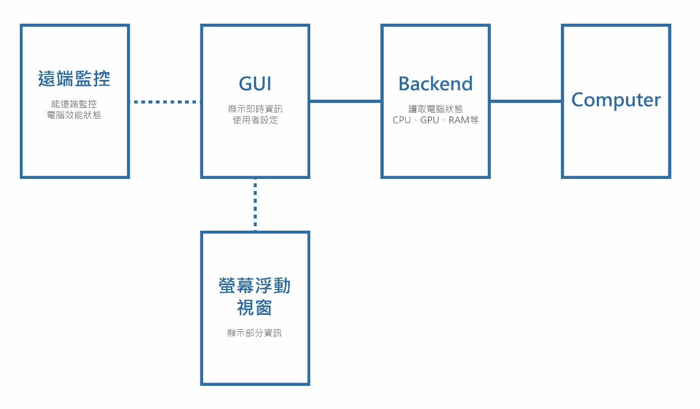

# 電腦效能監控程式

## Group14

- 41243208 蕭昱糖  
- 41243126 胡楨  
- 41243131 莊笙禾  

## 專題名稱
電腦效能監控程式

## 使用工具
- **Qt Creator**
- **JQ CPU Monitor**
- **C++ program language**

## 功能說明
1.	能即時監控電腦CPU、GPU、RAM、Memory等硬體狀態。
2.	GUI為半透明狀態，能夠顯示於螢幕畫面中。
3.	使用者能設定要顯示那些資訊。
4.	可以設定電腦開機時自動啟動。
5.	能遠端監控電腦效能。

## 示意圖

