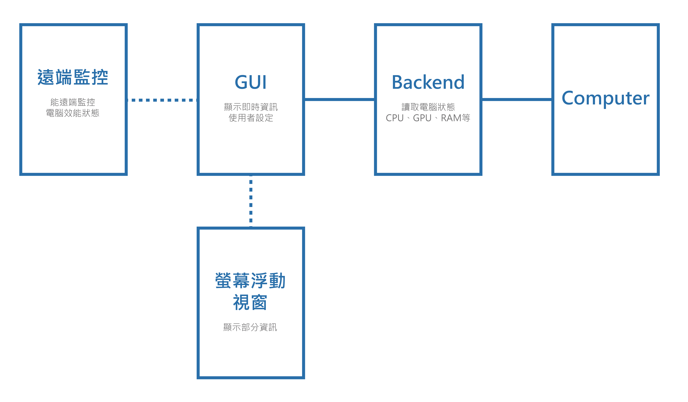

# 電腦效能監控程式
## 第14組
- 41243208 蕭昱糖
- 41243126 胡禎
- 41243131 莊笙禾

## 使用工具
- Qt Creator
- Windows Management Instrumentation
- Pdh.h
- QWidget
- QProcess
- C++ 程式語言

## 功能說明
1. 即時監控電腦的 CPU、GPU、RAM、記憶體等硬體狀態。
2. 半透明的 GUI 介面，可以顯示在螢幕上，且不會擋住其他應用程式。
3. 使用者可自訂顯示哪些資訊。
4. 支援遠端監控電腦效能。

## 示意圖

## 主介面UI

